# CIS 566 Homework 3: Environment Setpiece

## Stephanie Goldberg - slgold
- ShaderToy Link: https://www.shadertoy.com/view/3dSGWc
- Takes about 8 seconds to compile. I worked off the smallscreen window, not in fullscreen. Animation moves slower in fullscreen view.
- Buffer A code in BufferA.txt
- Image code in Image.txt

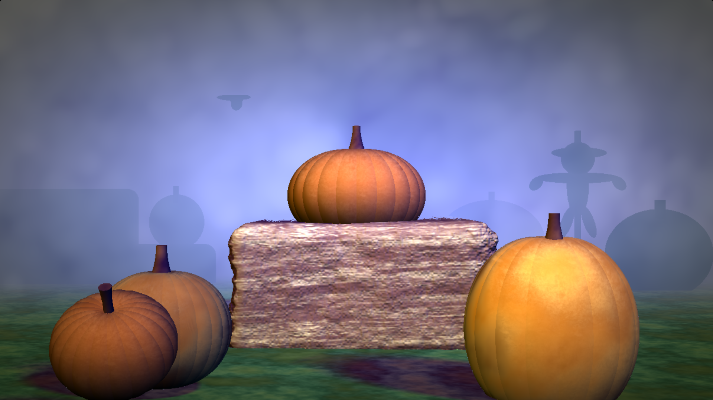

## References
- Ray Marching: https://www.shadertoy.com/view/llt3R4?fbclid=IwAR21LoMdpVgEXx1MsLjWbc5EEB9Romw6Q9CJoKZeiMTTWDNQMAdSmGN69S0
- Pumkpin Shape: https://www.shadertoy.com/view/lt3fWj
- Background Blur: https://www.shadertoy.com/view/ld3Gz2
- Modified Cone Shape: https://www.shadertoy.com/view/ldlcRf
- Penumbra Shadows: https://www.shadertoy.com/view/wsjGDG
- Class slides on Visual Effects: https://docs.google.com/presentation/d/e/2PACX-1vRgbUo4F0FzK3LhmXHqsTMyd5BDun0l0vHH1GicPntzgl2_ARjsYmUiFDbU7pY-cXGo0OiTX4Rn0OPb/pub?start=false&loop=false&delayms=3000&slide=id.g4f853a1f95_0_35

## Animation
- Crow flies across the background. Used a mod function with the X direction to reset the crow's position back to where it started once it reached the edge of the screen.
- Scarecrow color animated to create the illusion it is dissapearing and reappearing into the fog. Animation of color done by mixing the silhouette color and the background color using sin of iTime. 
- Pictures of the scarecrow animation (the flying crow can be seen here too):
 - 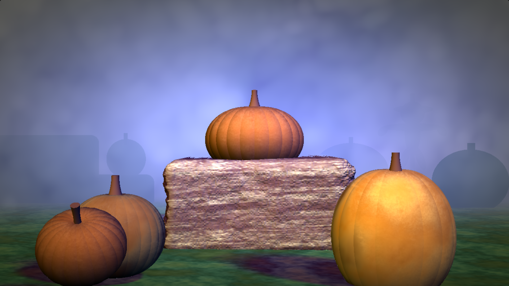
 - 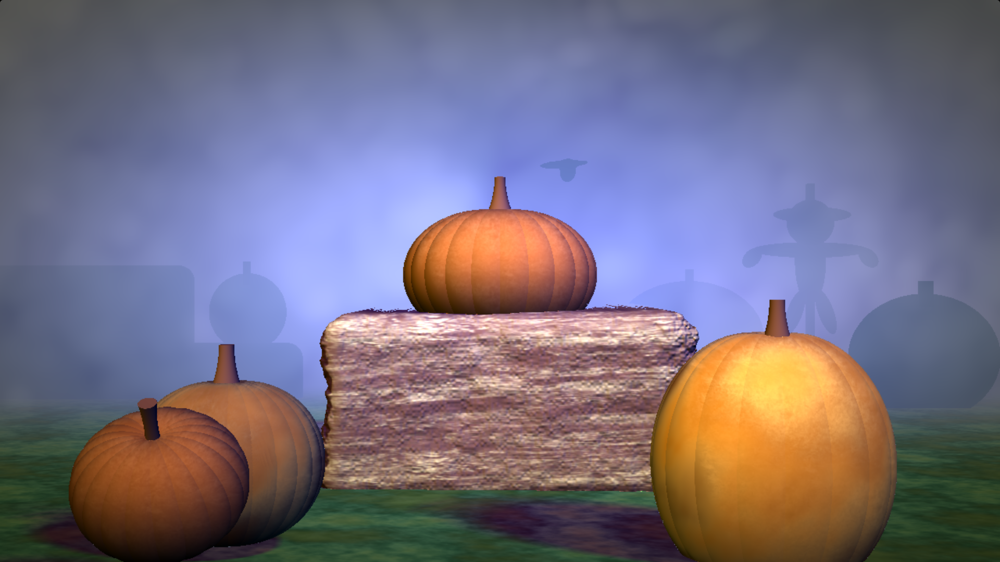
 - 

## Noise and Toolbox Functions
- Coloring of grass patches on the ground done with smoothstep and FBM to create darker patches of green grass.
- Shape and color of the hay bale. Shape of the hay bale created by adding some noise into the X and Y values of the rounded box SDF. Color of the hay bale made from using the smoothstep function and a noise image provided by Shader Toy.
- Pictures of the hay bale progression from the rounded box:
- 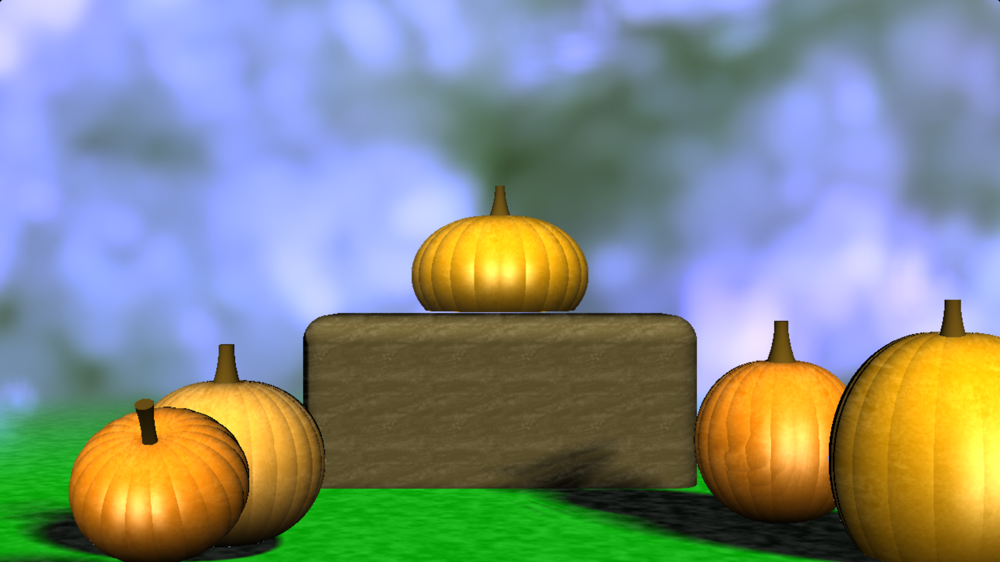
- 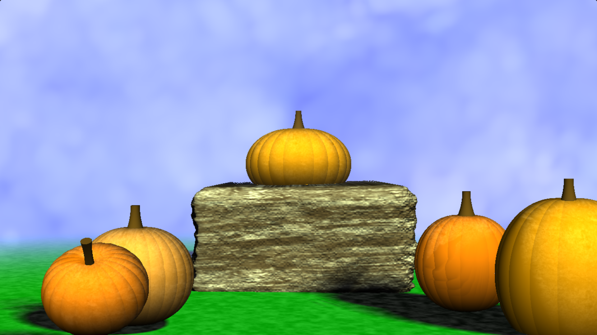
- Crow's flying motion utilizes noise. Y direction motion is based on a sin curve, iTime, and a noise term. X direction motion is based on a modified sin curve, iTime, and a noise term. Used toolbox function smoothstep with FMB to create the noise term used in the crow's movement.
- Used hash functions to create the noise with FBM2 function.
- Coloring of some of the pumkpins tuned with gain and bias toolbox functions. Used to darken some pumkpins.
- Coloring of the pumkpins and their stems done with FBM and hash noise functions.

## Remapping Values to Set of Colors
- Cosine palette remapping for age spots on pumkpins.
- Remapped values with a cosine pallette to create the varied-colored patches on the ground.

## Lighting
- One ambient light
- Three directional lights with colors to create a spooky atmosphere.
  + Blue light
  + Reddish light
  + Dark Blue light
- Pictures of Lighting progression:
- 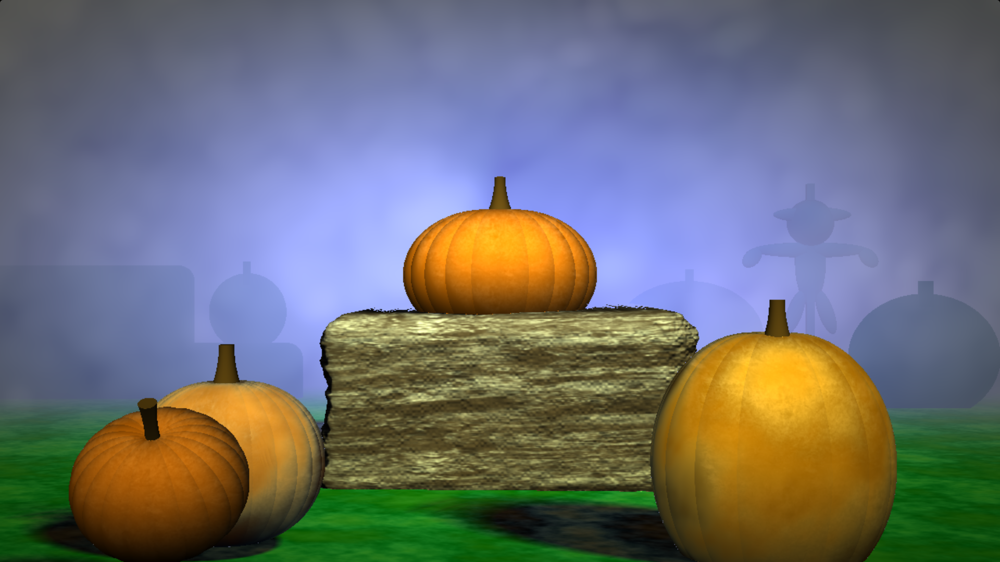
- 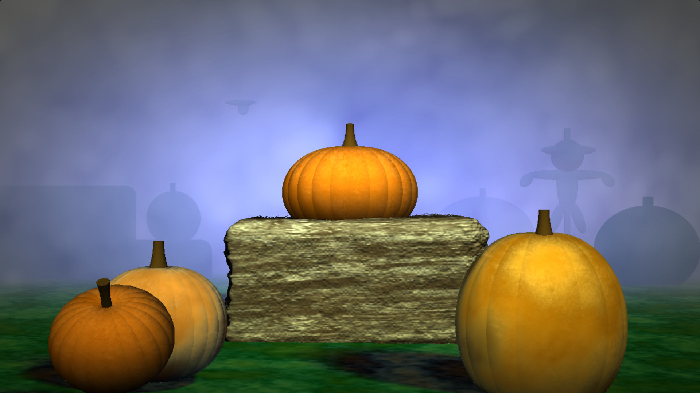
- 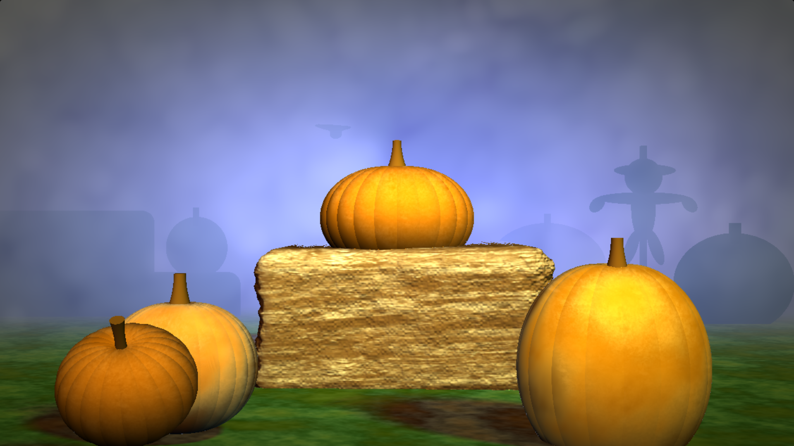
- 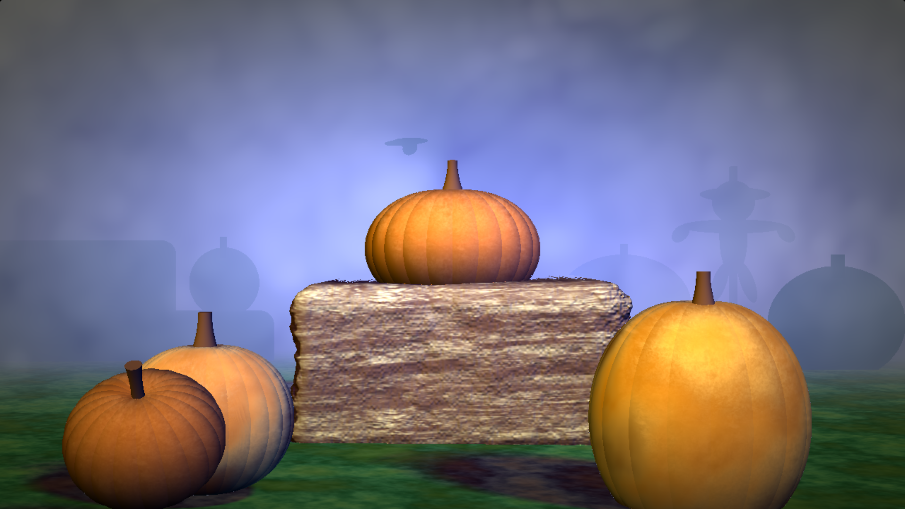
- 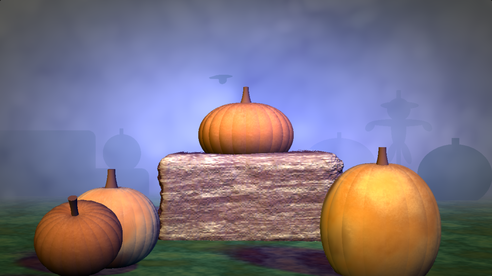
- 

## Soft Shadows
- Penumbra shadows cast from pumkpins and hay bale in the scene.
- Objects in the background fog do not cast shadows. This was intentional to create the appearance of silhouettes.
  
## Vignette
- Post-process vignette effect to tint the edges of the image a brown/red color. The center of the screen is not affected, the further away from the center, the darker the vignette effect gets.
- Pictures of image without and with the vignette effect:
- 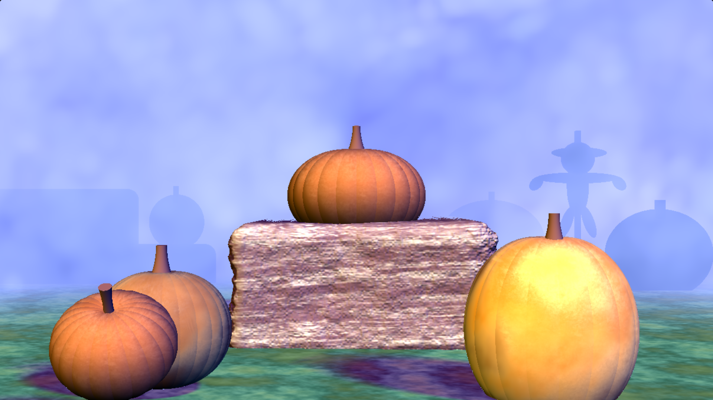
- 

## Distance Fog
- Spooky blue fog to obscure background elements and blend the foreground to the background.

## SDF blending
- The crow form is made from blending the body with the wing to appear as one shadow in the background.
- The scarecrow's hat rim is blending into the head shape to appear as one, seemless form.
